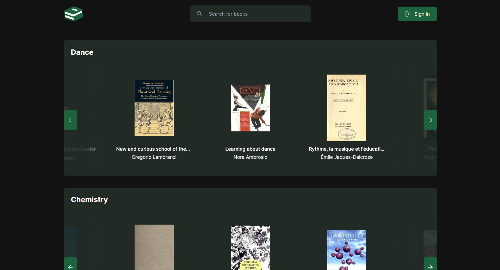

# My-bookshelf

Built with NextJS, Supabase, and Taiwlind.

## Features

 - Login via email or github
 - On first login you can choose book subjects you're into 
 - You can go to /subject page and favorite or mute subject (if you favorite, the subject will appear in your feed, if you mute the subject won't appear again in your feed)
 - On /new-bookshelf you can create a new bookshelf that you can later edit, delete or share with your friends
 - You can also add books from /book page
 - Edit your profile on /edit-profile
